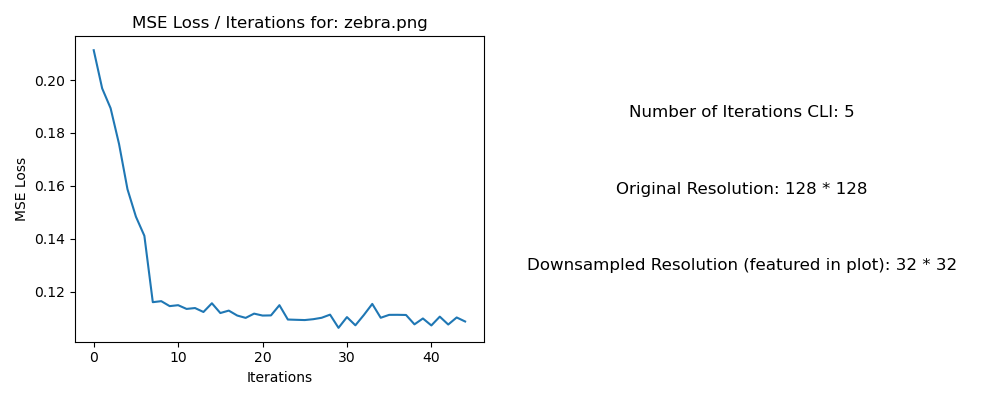
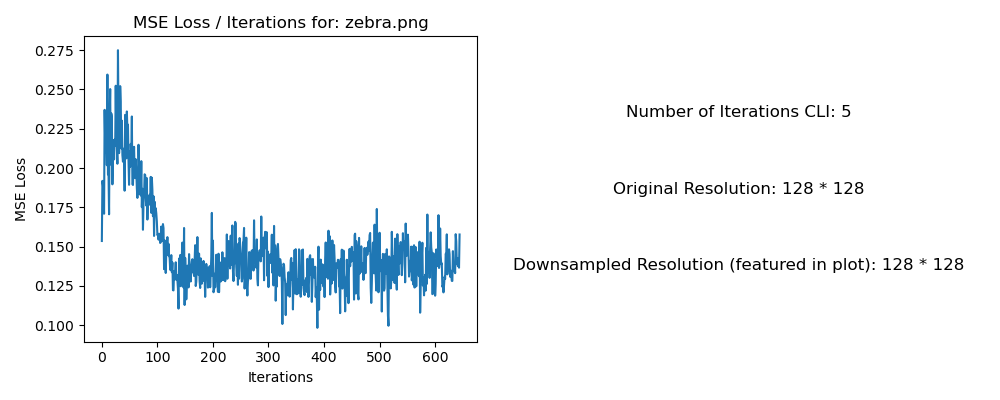
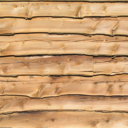

<html>
<head>
    
    
</head>
</html>

# C.A.R.L. 3D Texture Synthesis from 2D Exemplars ort Final Report
By: C.A.R.L. (Catherine Van Keuren, Anthony Salinas Suarez, Rohan Mathur, Longchao (Joy) Liu)

## Abstract
For this project, our overall goal was to implement a way to use 2D texture exemplars to synthesize 3D solid textures. We not only wanted to be able to map textures to the surface of solids, but we also took on the challenge to map the texture to the inside of the solid. The challenge with 3D texture mapping is that rather than just the surface texture aligning, we also need to make sure that each slice within the solid's texture aligns as well. We modeled our implementation off that of Johannes Kopf, et al. utilizing the methods described in their paper titled "Solid texture synthesis from 2D exemplars." The process used in their paper entails iterating over every cross section slice of voxels within the solid, and performing texture mapping to those slices. This process was implemented using two main phases: the Search Phase and the Optimization Phase. The Search Phase involves finding the patch of texture that best matches the solid slice, and the Optimization Phase involves iterively modifying specific voxels within the solid slices until it more closely matches the exemplar patch. _Our primary contributions include 1) implementing this project from scratch using PyTorch to take advantage of its batching capabilities, yielding a much faster rendering, 2) creating novel viewing tools for 3D visualization, and 3) creating GIFs and loss plots to assess the utility of different phases of the generation process._

## Technical approach
**A 1-2 page summary of your technical approach, techniques used, algorithms implemented, etc. (use references to papers or other resources for further detail).
Highlight how your approach varied from the references used (did you implement a subset, or did you change or enhance anything), the unique decisions you made and why.**

As mentioned in the abstract, the 3d texture synthesis was done in two main stages: the Search Phase and the Optimization Phase that we alternativelt iterate through. The goal of these two stages is to determine the ideal mapping of the texture onto each voxel in the solid, thus minimizing a chosen energy function. In particular, we want every neighborhood (8x8 patch of voxels) on any 2D slice through the 3D solid to be similar to some neighborhood in the texture. For simplicity, we only accounted for slices that laid along the three main directional axes (x, y, z). This process can be seen below in an image from the Kopf, et al. paper.

This energy function that we are trying to minimze is defined as:

$
E(s, \{e\}) = \sum_{v} \sum_{i \in \{x, y, z\}} \| s_{v,i} - e_{v,i} \|^{r}
$

where $e$ is the input exemplar and $s$ is the synthesized solid. Additionally, $s_{v}$ represents a single voxel and $s_{v, x}, s_{v, y},$ and $s_{v, z}$ are the neighborhoods of $v$ in the slides orthogonal to the x, y and z axises. Lastly, $r$ is set to a value of 0.8 to be more robust against outliers.

In addition, we carried out this process in a multiresolution fashion, starting with a coarser version of the volume and switching to a finer level and so on. More information about this process can be found in the Pyramid Search section.

Before starting the iterations of these phases, we had to do a bit of preprocessing. First, we needed to take our object file and voxelize it. This was done using a Python library Trimesh and it's built in function:

 `trimesh.voxel.creation.voxelize(mesh, pitch=pitch).fill()`.

After that, we assign each voxel within our solid a random color value from the exemplar, and then begin iterating through the two phases. 

### Search Phase
During the search phase, our main goal is to search for the best matching exemplar neighborhoods $e_{v, i}$ for each voxel $s_{v, i}$. This is implemented using a standard nearest neighbor search in high-dimentional space.

**Nearest Neighbors**

For each patch in the solid, we found the most similar patch in the exemplar texture. To match the solid patches to exemplar patches, we used the [AnnLite](https://github.com/jina-ai/annlite) library with the similarity metric of cosine similarity for fast approximate nearest neighbors. Following the paper, we used Principle Component Analysis (PCA) to reduce the dimensionality of the patches to further speed up the Nearest Neighbors. We procomputed the PCA vectors and coordinates of the exemplar texture at the beginning of the Optimization phase, then we projected the solid patches into the PCA coordinates at each iteration. We verified that the matches became more similar over the course of iteration: 

Zebra Texture (with 5 iterations):

   
  

  

   

   

<!---
Jagnow Texture (with 5 iterations):

   
  

  

  

   

Woodwall Texture (with 5 iterations):

   
  

  

  

   

-->

**Pyramid Search**

To vary the context given to the pixel we're optimizing, we nested our optimization phase inside a pyramid search. This change in resolution helps the pixel see more of its surrounding, focusing first on low frequency regional and then on high-frequency details at the end. In our implementaton, we kept the neighborhood dimension constant. First, we downsampled the texture and the solid to the lowest resolution at the beginning of the outer loop, then for each iteration we interpolated the texture and the solid up the next resolution.

### Optimization Phase
After we have found the exemplar patch that best matches the patch in our synthesized solid, we move onto the optimize phase, where we modify voxels one by one until our energy function that measures the differences between the two converges to a desired point. This is done by using iteratively re-weighted least squares to minimize the energy function, and then improved upon by adding in Histogram Matching. 

**Optimization**

As previously mentioned, the overall goal of the optimization phase is to minimize our energy function. We can rewrite the terms our original energy function as follows:

$
\| s_{v,i} - e_{v,i} \|^{r} = \| s_{v,i} - e_{v,i} \|^{r-2} \| s_{v,i} - e_{v,i} \|^{2} = \omega_{v,i} \| s_{v,i} - e_{v,i} \|^{2}
$

where $ w_{v, i} = \| s_{v,i} - e_{v,i} \|^{r-2} $ is what we consider the weight. This weight is later updated when using Histrogram Matching.

These terms can then be used to minimize the following functional:

$
E(s, \{e\}) = \sum_{v} \sum_{i \in \{x, y, z\}} \sum_{u \in N_{i}(v)} \omega_{v,i,u} (s_{v,i,u} - e_{v,i,u})^2
$

In this equation, $N_{i}(v)$ indicates the neighborhood of the voxel $v$ in the slide perpendicular to the $i$ th axis, and until we add in Histogram Matching, we use the same weight value for each voxel in the neighborhood.

Luckily for us, instead of having to manually do out the IRLS, the Kopf et. al paper provides a closed-form solution to the minimization:

$
s_v = \frac{\sum_{i \in \{x, y, z\}} \sum_{u \in N_i(v)}\omega_{u,i,v} e_{u,i,v}}{\sum_{i \in \{x, y, z\}} \sum_{u \in N_i(v)} \omega_{u,i,v}}
$

Here, $s_v$ indicates the value of the voxel that minimizes the energy function, and $e_{u, i, v}$ denotes the exemplar texel in the neighborhood that corresponds to $v$. Thus, the optimal value of each voxel is simply a
weighted average of a collection of texels from different exemplar neighborhoods.

In the original paper, they also utilized a clustering approach using the Mean-Shift algorithm for cases where the varience of the exemplar texels is too large and yields a blurry result. We were unfortunately unable to implement this approach due to time constraints, but we believe that it could have helped us yield crisper results.

**Histogram Matching**

Adding Histogram Matching allows us take global statistics into account to make sure that we are not converging to the wrong local exemplar patch in the previous step. In order to implement Histogram Matching, we add a step during the Optimization Phase that updates our previously calculated weight. This is done by first creating three 16 bin histograms (one for each R, G, and B channel) based on the original texture image using `torch.histc(...)`. For each solid patch, we also create the same histogram. Then, we update the weight using the given formula:

  

Here, Hs,j and He,j denote the j-th histogram of the solid and the exemplar, respectively, let H(b) denotes the value of bin b in a histogram H. Next, for a color c, let bj(c) specify the bin containing c in the histograms Hs,j and He,j. This allows us to adjust our weights with respect to the global and local color distribtuions.

### Visualization

To visualize our results, we implemented a viewer using [viser](https://viser.studio/) to see the 3D output voxel grid (in full or at cross sections). We also output renders of the exterior of the final output at different angles to construct a full resolution video of our 3D results.

### Problems We Encountered

Throughout the project, we encountered several issues, some of which we were able to solve, and some we weren't.

One of the first problems that we had was a buggy optimization phase implementation, and we are still unsure if it works 100% as it should. Originally, when we would run the optimization code on a randomly generated 2D patch, each iteration would fill the image with one color. This is demonstrated below, where we called our optimization phase code on a randomly generated patch based on the tomato texture. As you can see, the image became overwhelmingly brown since that is likely the average color in the image.

  

This was resolved once we implemented histogram matching, meaning that the calulcation of our weights or how we updated color values was somewhat off.

Another problem we encountered was determining how we should be iterating through and updating each voxel. For most of the time we were working on the project, we had the idea of only updating one random neighborhood per iteration, and then iterating many times so that on average, we eventually get a completed solid. However, we realized later on that the paper actually scans and updates the entire solid for each iteration, thus needing fewer iterations. Once we made this change, we noticed better results, even if it caused our runtime to ultimately slow down. As you can see below, the patch created by iterating over all of the pixels rather than sampling yields a bit of a cleaner image.

<tr align="left">
			<td>
      <figcaption>Sampling</figcaption>
			   
			</td>
			<td>
      <figcaption>Iterating Over Entire Patch</figcaption>
			  
			</td>
  </tr>

### Lessons Learned

One of the biggest lessons learned for a few of the teammates was how to write code in PyTorch and make use of its batching capabilities via tensors. It definitely had a pretty significant learning curve for the members who had little to no prior experience with the language, but it significantly helped the speed of our implementation.

We also learned more about texture mapping and cool algorithms that can be used to optimally map textures to shapes with more than two dimmentions. It also gave us the opportunity to learn more about how varying different parameters (number of iterations, levels of resolution, etc) can affect tge output image and how we can finetune these values.

### Further Work

We believe that the speed of the GPU implementation could be made much better by being able to futher batch some operations. Right now, the nearest neighbors in the search phase is not using a pytorch library, so it cannot be parellalized on GPU. We also iterate through the batch to sample neighborhoods around a chosen pixel to optimize. These two parts of the pipeline are most likely what are bottlenecking our cuda run speeds.

## Results
**Your final images, animations, video of your system (whichever is relevant). You can include results that you think show off what you built but that you did not have time to go over on presentation day.**

### Search Phase
Results of the Nearest Neighbors Search on a 2D patch of solid pixels.

### 2D Texture Synthesis
Results of our full implementation on a 2D slice initialized to random texel values. Visualized below are is the synthesized output every 50 batched updates, at three different pyramid search resolutions but interpolated to the same resolution.

**Zebra Texture**

   
  
   

**Dune Texture**

   
  

**Caustic Texture**

   
  
   

### 3D Texture Synthesis
Results of our full implementation on a variety of 3D solids.

**Zebra Textured Cube**

  

**Caustic Textured Cheburashka**

  

**Zebra Textured Cow**

  

## References
Kopf, J., Fu, C.-W., Cohen-Or, D., Deussen, O., Lischinski, D., & Wong, T.-T. (2007). Solid texture synthesis from 2D exemplars. ACM Transactions on Graphics, 26(3), 2. https://doi.org/10.1145/1276377.1276380

Viser. https://viser.studio/

## Contributions
Joy
- Assisted in search phase implementation
- Assisted in pyramid downsampling implementation
- Batched PyTorch pipeline
- Created GIF visualizations 

Rohan
- Assisted in implementation of the optimization phase and histogram matching code
- Developed 3D visualization system, tooling, and interfaces
- Helped write and integrate pyramid downsampling
- Helped batch the pipeline and developed GPU support

Anthony
- Assisted in search phase implementation
- Assisted in pyramid downsampling implementation
- Assisted in validation testing to fine tune parameters for different textures
- Orchestrated experiments to generate mean squared error loss plots for different texture/hyperparameters

Catherine
- Assisted in implementation of the optimization phase and histogram matching code
- Created and formatted the milestone and final report website
- Wrote the milestone writeup and final report write up (minus the Search Phase section)
- Helped testing various paramater combinations to identify ideal fields
