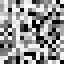

# C.A.R.L. 3D Texture Synthesis from 2D Exemplars

By: Rohan Mathur, Joy Liu, Anthony Salinas Suarez, Catherine Van Keuren

[Milestone](./milestone.md)

[Final Report](./final-report.md)

   
   
   

  
  
  

